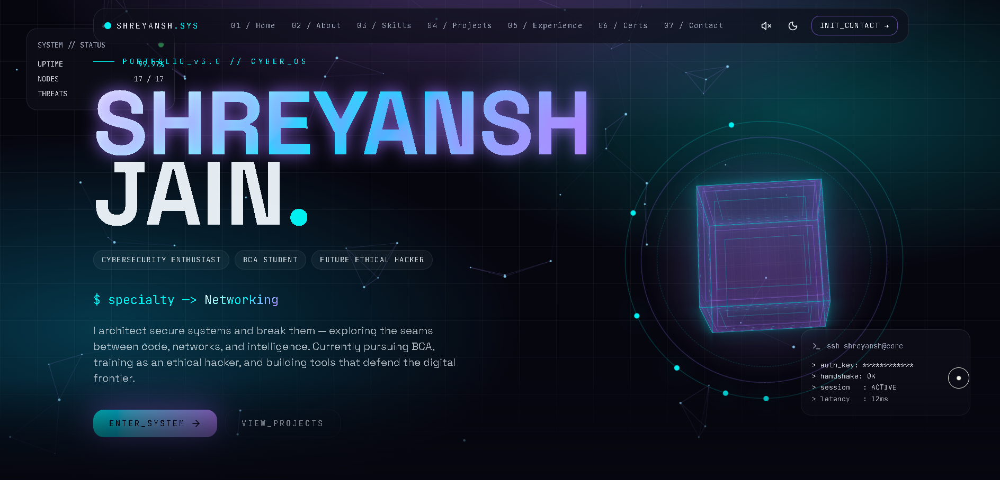

<div align="center">

# Shreyansh Jain — Futuristic Cybersecurity Portfolio

A production-grade, cinematic portfolio experience with a terminal-inspired interface, glassmorphism surfaces, and restrained neon accents.

[](https://vitejs.dev/)
[](https://react.dev/)
[](https://www.typescriptlang.org/)
[](https://tailwindcss.com/)

<br />

<p align="center">
  <a href="https://shreyanshjain.vercel.app">
    
  </a>
</p>

</div>

## Live Website

https://shreyanshjain.vercel.app/

## Overview

This repository contains **Shreyansh Jain’s** futuristic cybersecurity portfolio—built as a **Vite + React SPA** with an engineering-first approach to UI. The design direction is cinematic and minimal: dark premium surfaces, glass panels, neon purple/electric blue accents, and motion that supports the narrative without overwhelming the content.

The result is a clean, production-grade frontend that prioritizes responsiveness, performance, and a distinctive visual identity—while keeping the experience readable and fast.

## Features

- **Immersive animations**: Framer Motion transitions and section reveals tuned for a cinematic flow
- **Glassmorphism UI**: layered panels, subtle borders, glow shadows, and depth
- **Responsive architecture**: mobile-safe spacing and layouts without compromising desktop presentation
- **Cinematic interactions**: terminal-inspired UI patterns and tactile micro-interactions
- **Formspree integration**: production email submissions with validation + loading/success/error states
- **Downloadable resume**: direct PDF download with a stable filename
- **SEO optimization**: metadata configured for social previews and search indexing
- **Vercel deployment**: static hosting with SPA rewrites and `dist/` output

## Tech Stack

| Category      | Tools         |
| ------------- | ------------- |
| Framework     | React         |
| Language      | TypeScript    |
| Build Tooling | Vite          |
| Styling       | TailwindCSS   |
| Motion        | Framer Motion |
| Icons         | Lucide React  |
| Forms         | Formspree     |
| Deployment    | Vercel        |

## Architecture

- **Standard SPA**: compiled to static assets in `dist/` using Vite
- **Client-side routing**: React Router handles navigation and SPA fallbacks
- **Component-first UI**: sections composed from focused components for reuse and maintainability
- **Data-driven content**: editable JSON files under `src/data/` for profile and links
- **Production-ready ergonomics**: minimal runtime complexity (no SSR, no server adapters)

## Folder Structure

```text
.
├─ public/
│  ├─ favicon.svg
│  ├─ site.webmanifest
│  └─ resume.pdf
├─ src/
│  ├─ components/
│  ├─ data/
│  ├─ App.tsx
│  ├─ main.tsx
│  └─ styles.css
├─ index.html
├─ package.json
├─ tsconfig.json
├─ vite.config.ts
└─ vercel.json
```

## Installation

### Prerequisites

- Node.js (LTS recommended)
- npm

### Setup

```bash
npm install
```

## Development Commands

```bash
npm run dev
```

```bash
npm run build
```

```bash
npm run preview
```

## Deployment (Vercel)

This project deploys as a **static Vite SPA**:

- **Build command**: `npm run build`
- **Output directory**: `dist`
- **SPA rewrites**: configured in `vercel.json` to route all paths to `index.html`

## Environment Variables

This repository can run without environment variables. If you prefer configuration via env instead of hardcoding service endpoints, use:

## Screenshots

```md



```

## Credits

- **Framer Motion** — motion primitives and animation system
- **Vite** — build tooling and dev server
- **TailwindCSS** — styling framework
- **Lucide React** — icon library

## License

UNLICENSED — All rights reserved.

## Contact

- **GitHub**: https://github.com/sj-builds
- **LinkedIn**: https://www.linkedin.com/in/shreyanshjain-tech
- **X / Twitter**: https://x.com/jshreyansh962
- **Email**: jshreyansh962@gmail.com

---

<div align="center">

**Built to feel cinematic. Engineered to ship.**

</div>
